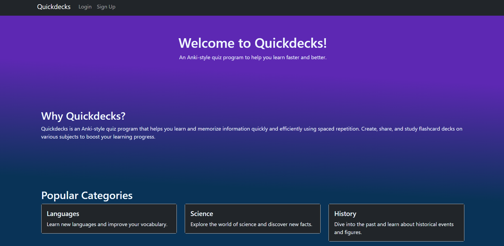

# Quickdecks

## Description

Quickdecks is an application where users can review and test their learning by creating flashcards and quizzes for their subjects of choice. By creating an account users can access, edit, delete, and create their study materials any time as well as track their progress. This application is deployed to Heroku and does not require installing anything to use it.

Access the app here: https://quickdecks.herokuapp.com/ 

## Usage

To begin, click on the Sign Up link located in the navigation bar. You will be required to provide an email, set a username and password. These can be changed in Account Settings, also located in the navbar once the user has signed in. The user's dashboard has a Categories section and a Flashcards section where they can easily access what they have created. To create a new set of flashcards, press the "Create a New Flashcard Set" button to open the form where you can input the Title, Category, Questions and Answers. You can keep adding as many as you want by selecting the "Add question" button at the bottom of the form. You can close and reset the form by selecting the 'Cancel' button. Once you have input all the fields, you can create your deck by selecting the "Create flashcards" button. This will generate a thumbnail card with the Title, Category, and link to your flashcards, located under My Flashcards in the dashboard. Selecting the link will open the deck and allow you to view each flashcard with an option to flip it to see the correct answer and a submission button to test yourself.

## License

This project is licensed under the [MIT](https://opensource.org/licenses/MIT) license. See the [LICENSE](./LICENSE) file for details.

## Testing

This app was tested using Insomnia.

## Built With

- Sequelize
- MySQL2
- Express
- Handlebars
- Bcrypt
- Bootstrap
- Lodash
- Body-Parser

## Collaborators 

[sandragruiz](https://github.com/sandragruiz)    
[stephen-castillo](https://github.com/stephen-castillo)  
[rnutall](https://github.com/rnutall)  
